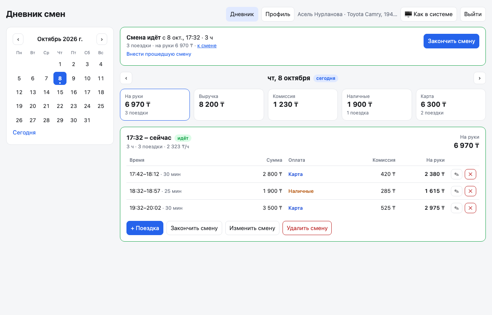
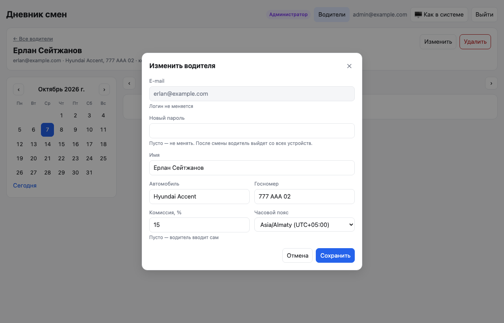

# Дневник смен водителя

Веб-приложение для водителей такси и их администратора. Водитель начинает и заканчивает смены, записывает поездки внутри смены и видит, сколько заработал за день и за смену: выручка, комиссия, «на руки», наличные и карта, «на руки» в час. Администратор заводит водителей, задаёт им автомобиль и комиссию, смотрит и исправляет их дневники.

- **Бэкенд:** Python 3.12, FastAPI, Pydantic v2, async psycopg 3, SQL без ORM, сервер granian; зависимости — uv
- **База данных:** PostgreSQL 16, схема только через миграции [dbmate](https://github.com/amacneil/dbmate)
- **Кэш:** Redis 7 перед базой; при отказе Redis — память процесса
- **Фронтенд:** React 19, TypeScript, Vite, React Router, TanStack Query, react-hook-form и zod; типы API генерируются из OpenAPI
- **Запуск:** Docker Compose; nginx раздаёт фронтенд и проксирует `/api` в бэкенд
- **Качество:** ruff, mypy `--strict`, pre-commit
- **Тесты:**
  - бэкенд — 311 тестов pytest: unit-тесты и интеграционные на настоящих PostgreSQL и Redis;
  - фронтенд — 67 тестов Vitest;
  - сквозные — 10 сценариев Playwright для обеих ролей, каждый на экране компьютера и телефона.



## Запуск

```bash
cp .env.example .env
docker compose up -d --build
```

Откройте http://127.0.0.1:8080. Compose запускает по порядку:

1. `db` — PostgreSQL 16 и `redis` — Redis 7 (только кэш, без сохранения на диск).
2. `migrate` — dbmate применяет миграции из `backend/db/migrations` и завершается.
3. `bootstrap` — разовые задачи старта (`backend/scripts/bootstrap.py`): демо-аккаунты и первый администратор.
4. `app` — API на FastAPI под granian, два рабочих процесса (`GRANIAN_WORKERS`). Наружу не опубликован, схему базы не создаёт и не меняет.
5. `web` — nginx на порту 8080: раздаёт собранный фронтенд и проксирует `/api` в `app`. Документация API — http://127.0.0.1:8080/api/v1/docs.

Демо-аккаунты создаются при `SEED_DEMO=1` (по умолчанию):

| Роль | E-mail | Пароль |
|---|---|---|
| Администратор | admin@example.com | admin12345 |
| Водитель с примером смен (1–2 октября 2026) | demo@example.com | demo12345 |
| Водитель с комиссией 15% и госномером | erlan@example.com | erlan12345 |

Демо-аккаунты создаются только в пустой базе. Поэтому водитель, которого администратор удалил, после перезапуска не появится снова. Данные хранятся в томе `pgdata`; чтобы начать с чистой базы, выполните `docker compose down -v`.

Все настройки — в [`.env.example`](.env.example), по разделам: база (`POSTGRES_*`), кэш (`REDIS_URL`), сервер, старт, логи. Пароли и адреса в коде не записаны.

### Первый администратор

Самостоятельной регистрации нет: аккаунты водителей создаёт администратор. Первого администратора можно завести тремя способами:

1. Задать переменные `ADMIN_EMAIL` и `ADMIN_PASSWORD`. Сервис `bootstrap` создаст аккаунт, если такого e-mail ещё нет.
2. Запустить скрипт. Пароль спрашивается интерактивно и не попадает в историю shell:
   ```bash
   docker compose run --rm bootstrap python -m scripts.create_admin boss@company.kz
   ```
3. Включить демо-администратора через `SEED_DEMO=1`. Это для проверки, не для боевой работы.

Существующий аккаунт водителя никогда не становится администратором неявно.

### Миграции

Схема меняется только миграциями. Каждая миграция — один файл `backend/db/migrations/<время>_<название>.sql` с секциями `-- migrate:up` и `-- migrate:down`.

| Миграция | Что делает |
|---|---|
| `…01_init` | Пользователи, профили водителей, сессии, поездки |
| `…02_shifts` | Смены. Существующие поездки собираются в смены: одна на водителя и день |
| `…03_trip_commission_pct` | Поездка запоминает процент, по которому посчитана её комиссия |
| `…04_stricter_data` | Поездки не пересекаются; их длительность и сумма ограничены. Часовой пояс хранится как название IANA. Модель машины и госномер разделены, номер уникален |
| `…05_v1_uuid_and_names` | Ключи UUID вместо чисел со всеми связями; понятные имена колонок (`started_at`, `fare`, `payment_method`, `full_name`…) |

```bash
cd backend
export DATABASE_URL="postgres://shifts:<пароль>@127.0.0.1:5433/shifts?sslmode=disable"
export DBMATE_MIGRATIONS_DIR=db/migrations DBMATE_NO_DUMP_SCHEMA=true
dbmate new add_something   # новая миграция
dbmate up                  # применить
dbmate rollback            # откатить последнюю
```

Источник истины — только миграции, снимок схемы `schema.sql` отключён. Тест `test_migrations.py` проверяет, что миграции применяются на пустую базу, откатываются по одной до конца и применяются снова. Перенос данных тоже покрыт тестами на данных старого вида:
- старые смещения превращаются в часовые пояса;
- госномер вынимается из текстового поля «автомобиль»;
- числовые ключи становятся UUID, а все связи переносятся. Поездка, у которой `id` уже был UUID, сохраняет его. Остальные получают постоянный UUID, вычисленный из водителя и старого `id`. Откат миграции снова нумерует записи числами в порядке создания.

## Разработка и тесты

### Бэкенд

```bash
brew install uv dbmate
docker compose up -d db redis       # PostgreSQL на 5433, Redis на 6380

cd backend
uv sync                             # .venv по uv.lock: зависимости и инструменты разработки
uv run pytest                       # все тесты: unit + интеграционные
uv run pytest tests/unit            # только unit, без базы
uv run ruff check . && uv run ruff format .
uv run mypy                         # --strict

uv run pre-commit install           # из корня репозитория: проверки перед каждым коммитом
```

Pre-commit перед коммитом запускает ruff (линтер и форматирование), mypy `--strict`, проверку, что `uv.lock` соответствует `pyproject.toml`, `tsc` для фронтенда и общие проверки: YAML, TOML, конфликты слияния, ключи в коде. Правила ruff запрещают относительные импорты (`TID`), «магические» числа в сравнениях (`PLR2004`) и включают проверки безопасности (`S`). Настройки pytest, ruff и mypy лежат в `backend/pyproject.toml`.

Интеграционные тесты пересоздают схему отдельной базы `shifts_test` теми же миграциями и очищают таблицы перед каждым тестом. Эту базу контейнер создаёт при первом запуске. Тесты с Redis работают в отдельной базе Redis №15 и очищают её. «Сейчас» в тестах зафиксировано на `2026-10-03 12:00+05:00`, поэтому правила вида «не в будущем» и «не старше 7 дней» дают одинаковый ответ в любой день. Если PostgreSQL, dbmate или Redis недоступны, соответствующие тесты пропускаются с подсказкой.

### Фронтенд

```bash
cd frontend
npm install
npm run dev          # http://localhost:5173, /api проксируется в запущенный стек на :8080
npm test             # Vitest
npm run typecheck
npm run gen:api      # перегенерировать типы из OpenAPI бэкенда (openapi.json → src/shared/api/schema.d.ts)

npx playwright install chromium
npm run e2e          # Playwright против http://127.0.0.1:8080 (стек должен быть запущен)
node scripts/screenshots.mjs   # переснять скриншоты для README
```

Сквозные тесты сами создают водителей с уникальными e-mail и удаляют их после прогона. Поэтому их можно запускать повторно на базе с демо-данными. Один прогон входит в систему несколько десятков раз, а с одного адреса разрешено 60 входов за 5 минут. Поэтому между двумя полными прогонами подряд нужно подождать.

## Возможности

### Роли и права

| Действие | Водитель | Администратор |
|---|---|---|
| Начать и закончить смену, внести прошедшую | ✅ | — |
| Добавить поездку | ✅ в свою смену | — |
| Изменить или удалить поездку и смену | ✅ если смена открыта или закончилась не больше 7 дней назад | ✅ без ограничения |
| Свой часовой пояс | ✅ | — |
| Имя, автомобиль, госномер, комиссия, пароль водителя | только чтение (403) | ✅ |
| Список водителей с итогами и поиском | — (403) | ✅ |
| Создание и удаление водителей | — | ✅ |

### Водитель

- **Смена.** Кнопка «Начать смену» открывает смену с текущего момента. Внести прошедшую смену можно, если она началась не больше 7 дней назад. Пока смена идёт, вверху видны её длительность и сумма «на руки». Если смена открыта больше суток, приложение предупреждает, что её, похоже, забыли закончить, и просит указать время окончания.
- **Поездки** записываются только внутри смены. Форма подставляет начало поездки: это конец предыдущей поездки или начало смены. Каждая поездка показывает длительность и «на руки». Поездку можно изменить или удалить; удаление требует подтверждения.
- **День** — это смены, начавшиеся в этот день по местному времени. В сводке дня: «на руки», выручка, комиссия, наличные и карта. У каждой смены видны длительность и «на руки» в час.
- **Календарь** отмечает дни со сменами.
- **Комиссия.** Если администратор задал процент, комиссию считает сервер, а форма показывает расчёт. Если процента нет, водитель вводит комиссию сам.
- **Профиль.** Имя, автомобиль, госномер и комиссия видны, но изменить их нельзя. Водитель меняет только свой часовой пояс.

| День с ночной сменой | Ошибки под полями | Тёмная тема |
|---|---|---|
|  |  |  |

| Телефон | Профиль | Вход |
|---|---|---|
|  |  |  |

### Администратор

- **Список водителей:** e-mail, автомобиль и госномер, комиссия, число поездок, «на руки», последняя смена. Искать можно по имени, e-mail, модели или номеру; номер находится и с пробелами.
- **Создание и правка водителя.** Новый пароль завершает все сессии водителя.
- **Удаление водителя** с подтверждением. Вместе с аккаунтом удаляются все его смены, поездки и сессии.
- **Дневник водителя** — тот же календарь, сводка и смены. Администратор исправляет и удаляет поездки и смены без ограничения в 7 дней, но не добавляет их: записи ведёт водитель.
- **Администраторы через API водителей не видны** (404). Поэтому ни себя, ни другого администратора изменить или удалить через этот API нельзя.

| Водители | Дневник водителя | Правка водителя |
|---|---|---|
|  |  |  |

## API

Все пути — под версией `/api/v1`; без версии остаётся только `/api/health` для healthcheck. Следующая несовместимая версия появится рядом, как `/api/v2`, и не сломает старых клиентов.

Интерактивная документация — http://127.0.0.1:8080/api/v1/docs:
- у каждого метода есть описание, у основных запросов — примеры;
- все ответы с ошибками описаны общей схемой `ErrorBody`;
- cookie сессии объявлена схемой безопасности, поэтому видно, какие методы её требуют.

Идентификаторы — UUID: у пользователей и смен это UUIDv7, упорядоченные по времени создания; у поездок — UUID, который присылает клиент.

| Метод | Путь (после `/api/v1`) | Кто | Описание |
|---|---|---|---|
| POST | `/auth/login` | все | Вход `{email, password}` |
| POST | `/auth/logout` | все | Выход |
| GET | `/me` | все | Свой профиль с `role` |
| PATCH | `/me` | водитель | Только `{timezone}`; любое другое поле → 403 |
| GET | `/shifts/current` | водитель | Открытая смена или `null` |
| GET | `/shifts?work_date=` | водитель | Смены дня со сводкой каждой |
| POST | `/shifts` | водитель | `{}` — начать сейчас; `{started_at}` — с указанного времени; `{started_at, ended_at, note}` — внести прошедшую |
| GET | `/shifts/{shift_id}` | водитель | Смена с поездками |
| POST | `/shifts/{shift_id}/close` | водитель | Закончить: `{ended_at}`, без `ended_at` — сейчас |
| PATCH | `/shifts/{shift_id}` | водитель | Изменить `started_at`, `ended_at`, `note`; `ended_at: null` открывает смену снова |
| DELETE | `/shifts/{shift_id}` | водитель | Удалить смену вместе с поездками |
| GET | `/days` | водитель | Дни со сменами: `[{work_date, trips_count, net_income}]` |
| GET | `/summary?work_date=` | водитель | Сводка дня |
| GET | `/trips?work_date=` | водитель | Поездки дня |
| POST | `/trips` | водитель | Добавить поездку в смену: `{id?, shift_id, started_at, ended_at, fare, payment_method, commission_amount?}` |
| PATCH | `/trips/{trip_id}` | водитель | Изменить поля, в том числе перенести в другую смену |
| DELETE | `/trips/{trip_id}` | водитель | Удалить поездку |
| GET, POST | `/admin/drivers` | админ | Список водителей с итогами (`?q=` для поиска); создание водителя |
| GET, PATCH, DELETE | `/admin/drivers/{driver_id}` | админ | Карточка, правка, удаление водителя |
| GET | `/admin/drivers/{driver_id}/days`, `/summary`, `/trips`, `/shifts`, `/shifts/{shift_id}` | админ | Дневник водителя |
| PATCH, DELETE | `/admin/drivers/{driver_id}/trips/{trip_id}`, `/shifts/{shift_id}` | админ | Правка и удаление записей водителя без ограничения в 7 дней |
| GET | `/api/health` (без версии) | все | Проверка сервиса и базы для healthcheck |

```bash
curl -c jar -H 'Content-Type: application/json' \
  -d '{"email":"demo@example.com","password":"demo12345"}' http://127.0.0.1:8080/api/v1/auth/login

curl -b jar "http://127.0.0.1:8080/api/v1/summary?work_date=2026-10-01"
# {"trips_count":3,"revenue":7100,"commission_total":1065,"net_income":6035,
#  "cash":{"trips_count":1,"amount":1500},"card":{"trips_count":2,"amount":5600},
#  "work_date":"2026-10-01","shifts_count":1}
```

Закрытые значения передаются перечислениями: `role` — `driver` или `admin`, `payment_method` — `cash` или `card`, `status` смены — `open` или `closed`. В OpenAPI это отдельные схемы `Role`, `PaymentMethod` и `ShiftStatus`.

### Ошибки

Все ошибки приходят в одном формате:

```json
{"error": {"code": "validation_error", "message": "Some fields are invalid", "ctx": {},
           "fields": [{"field": "fare", "code": "greater_than", "message": "Input should be greater than 0",
                       "ctx": {"gt": 0}}]}}
```

- `code` — стабильный код для программ. Фронтенд переводит его на русский.
- `message` — текст на английском, запасной вариант для неизвестных кодов.
- `fields` — у 422 здесь сразу все ошибки, каждая привязана к своему полю.
- Введённое значение в ответ никогда не возвращается: это мог быть пароль.

Основные коды:

| Статус | Коды |
|---|---|
| 401 | `not_authenticated`, `invalid_credentials` |
| 403 | `drivers_only`, `admins_only`, `admin_managed_fields` |
| 404 | `not_found`, `driver_not_found` |
| 409 | `shift_already_open`, `shift_already_closed`, `shift_overlap`, `shift_locked`, `trip_overlap`, `trip_conflict`, `trip_changed`, `email_taken`, `plate_taken` |
| 415 | `unsupported_media_type`: изменяющий запрос не в `application/json` |
| 422 (поля) | `end_before_start`, `trip_too_short`, `trip_too_long`, `outside_shift`, `in_future`, `too_old`, `shift_too_long`, `before_last_trip`, `after_first_trip`, `commission_fixed`, `commission_exceeds_fare`, `invalid_plate`, `unknown_timezone`, `password_too_weak`, `password_too_common`, `password_like_email`, `extra_forbidden`, `null_not_allowed` и стандартные коды Pydantic |
| 429 | `too_many_attempts` (вход), `too_many_requests` (все запросы); в `ctx.retry_after` и в заголовке `Retry-After` — сколько секунд ждать |
| 500 | `internal_error`; в `ctx.request_id` — номер запроса для поиска в логах |
| 503 | `db_unavailable`: база недоступна, а сохранённой копии ответа нет; `Retry-After: 30` |

Ответы `POST /api/v1/trips`:

| Код | Когда |
|---|---|
| 201 | Поездка создана |
| 200 | Такая поездка уже есть: это повторная отправка. Возвращается существующая запись, дубль не создаётся |
| 409 `trip_conflict` | У водителя уже есть поездка с этим `id`, но с другими данными |
| 409 `trip_overlap` | Время пересекается с другой поездкой; её `id` — в `ctx.trip_id` |

### Заголовки ответа

| Заголовок | Значение |
|---|---|
| `X-Request-ID` | Номер запроса. Тот же номер стоит в логах nginx и бэкенда |
| `X-Cache` | `hit` — ответ из кэша, `miss` — из базы, `stale` — сохранённая копия, пока база недоступна |
| `X-Data-Stale: true` | Данные могут быть устаревшими: база недоступна, отдана последняя сохранённая копия |
| `Retry-After` | При 429 и 503: через сколько секунд повторить |

## Принятые решения

### Смены и время

1. **Поездка существует только внутри смены.** Смены одного водителя не пересекаются; это гарантирует база (`EXCLUDE USING gist`). Открытая смена у водителя может быть только одна — это частичный уникальный индекс. Смена длится не больше 24 часов (`CHECK`). Составной внешний ключ `(shift_id, driver_id)` не даёт положить поездку в смену чужого водителя.
2. **День — это местный день начала смены.** Ночная смена 20:00–04:00 со всеми поездками относится к дню начала: водитель так и считает «смену за пятницу».
3. **Смещение хранится отдельно.** `timestamptz` хранит момент и теряет исходное смещение: из базы вернулось бы `21:10Z` вместо `02:10+05:00`. Поэтому смещения записываются в отдельные колонки, и API отдаёт время ровно таким, каким его прислали.
4. **Часовой пояс водителя хранится как название IANA**, например `Asia/Almaty`, а не как фиксированное `+05:00`: правила пояса меняются со временем. Казахстан в 2024 году перешёл на единый пояс +05:00, а летнее время где-то есть до сих пор. Фронтенд переводит введённое время в смещение, которое пояс имел именно в тот момент, а не сегодня. Юнит-тесты проверяют это на поясе с летним временем и при часовом поясе браузера, отличном от пояса водителя.
5. **Окно в 7 дней.** Водитель вносит и правит только то, что было за последние 7 дней: старые записи не переписываются задним числом. Администратор исправляет без ограничения. Забытую открытую смену можно закрыть всегда: окончание при этом проверяется не по окну, а по правилу 24 часов.
6. **Будущее запрещено** с допуском в 5 минут на расхождение часов телефона и сервера.
7. **Поездки одного водителя не пересекаются.** Сервис заранее называет пересекающуюся поездку, а ограничение `EXCLUDE` в базе не даёт нарушить правило в обход сервиса. Длительность поездки — от 1 минуты до 6 часов, сумма — не больше 500 000 ₸; это защита от опечаток.

### Деньги

8. **Деньги хранятся целыми тенге**, float нигде не используется. «На руки» = выручка − комиссия.
9. **Комиссия строго меньше суммы поездки** (`0 ≤ commission_amount < fare`): поездка всегда оставляет водителю что-то «на руки». Правило продублировано `CHECK` в базе.
10. **Комиссию по проценту считает сервер:** сумма × % / 100 с округлением половины вверх в точной десятичной арифметике. Например, 2350 × 15% = 352,5 → **353**; встроенный `round()` дал бы 352. Фронтенд показывает тот же расчёт в целых числах; общие тест-кейсы есть в обоих проектах.
11. **Поездка запоминает свой процент.** При правке суммы комиссия пересчитывается по проценту самой поездки, а не по текущему проценту из профиля. Если администратор поменял процент с 15% на 20%, прошлые поездки остаются на 15%. У поездок с комиссией, введённой вручную, процента нет, и комиссия при правке остаётся ручной.

### Надёжность

12. **Защита от дублей — первичный ключ `(driver_id, id)` и `INSERT … ON CONFLICT DO NOTHING`.**
    - Фронтенд генерирует UUID один раз, когда открывается форма. Повторная отправка той же формы, например после обрыва сети, получает ответ 200 и существующую запись.
    - Если `id` не прислан, сервер вычисляет его из содержимого поездки (UUIDv5).
    - Тот же `id` с другими данными даёт 409: молча перезаписывать опасно.
    - Тест отправляет одну поездку из 8 потоков одновременно, и в базе остаётся ровно одна запись.
13. **Гонки разрешены блокировками.**
    - Добавление и правка поездки, правка, закрытие и удаление смены блокируют строку смены (`SELECT … FOR UPDATE`). Поэтому поездка не может оказаться вне смены, которую параллельно сократили или закрыли.
    - Блокировки всегда берутся в одном порядке: сначала смены по возрастанию id, потом поездка.
    - Начало смены сначала блокирует строку водителя. Без этого два одновременных запроса «начать смену» проверяли ограничение на пересечение смен и индекс «одна открытая смена» в разном порядке и ждали друг друга по кругу. PostgreSQL обрывал один из них как взаимную блокировку, и водитель получал 500. Теперь второй запрос ждёт первого и получает понятный 409 `shift_already_open`.
    - Тесты запускают параллельные запросы как настоящие одновременные корутины и проверяют, что взаимных блокировок нет.
14. **Версий записей и оптимистичной блокировки нет**, это сознательное решение. Правят двое — водитель и администратор, и редко одновременно, поэтому последнее сохранение побеждает.
15. **Каждый запрос к базе — одна явная транзакция** (`Database.unit_of_work()`). Если при создании водителя не сохранился профиль, например из-за занятого госномера, учётной записи тоже не будет.

### Кэш и отказоустойчивость

16. **Кэш чтений в Redis.**
    - GET-ответы кэшируются для каждого аккаунта отдельно: в ключе есть аккаунт, путь и параметры запроса. Чужой ответ отдать нельзя.
    - Свежесть держится не на времени жизни. У данных каждого водителя есть счётчик версии, и он входит в ключ. Любая успешная запись увеличивает счётчики до того, как клиент получит ответ. Поэтому чтение сразу после записи никогда не видит старую копию, причём в обе стороны: запись водителя обновляет итоги у администратора, правка администратора — дневник водителя.
    - Свежая копия живёт 30 секунд. Это ограничивает только изменения в обход API и цифры «на текущий момент» у открытой смены.
    - Неудачная запись (4xx, 5xx) кэш не сбрасывает.
17. **База недоступна.**
    - Чтение получает последнюю сохранённую копию: копии хранятся 24 часа. Ответ помечен `X-Data-Stale: true`.
    - Сессии проверяются по кэшу, поэтому вошедший водитель продолжает видеть свои данные.
    - Запись, вход и чтение без сохранённой копии получают 503 `db_unavailable` с `Retry-After`. Писать «в кэш», чтобы потом досылать в базу, опасно: можно потерять данные или нарушить правила, которые проверяет только база.
    - «База недоступна» определяется по коду SQLSTATE: нет соединения (класс `08`), сервер останавливается (`57P01`–`57P03`) или в пуле нет свободного соединения за 3 секунды. Взаимная блокировка или ошибка в запросе — это не недоступность базы, а ошибка в коде. Она отдаётся как 500 и попадает в лог с трассировкой.
18. **Redis недоступен.**
    - Автомат-предохранитель ждёт ответа Redis не больше 0,3 секунды. После сбоя он 10 секунд не обращается к Redis и работает с памятью процесса: кэш (не дольше 30 секунд, не больше 10 000 записей) и счётчики лимитов. Пользователь замечает только, что ответы немного медленнее.
    - Когда Redis возвращается, начинается новая «эпоха» ключей. Всё, что Redis хранил до сбоя, больше не читается: пока он был недоступен, записи увеличивали версии только в памяти.
    - В логах появляются события `redis_unavailable` и `redis_recovered`.
19. **Сессия в кэше не переживает смену пароля.** Новый пароль или удаление водителя увеличивает версию его сессий, и закэшированная сессия перестаёт действовать сразу, а не через минуту.

### Безопасность

20. **Доступ закрыт по умолчанию.**
    - `AuthMiddleware` пропускает без сессии только пути из списка `PUBLIC_ENDPOINTS`: вход, выход, документация, health. Любой новый путь под `/api` закрыт, даже если в нём забыли указать зависимость.
    - Сессия проверяется один раз в middleware; роль проверяется на уровне роутера: водителя, администратора.
    - Тест берёт все методы из OpenAPI и проверяет каждый без сессии (401) и с чужой ролью (403).
21. **Ограничение частоты запросов** (`ThrottleMiddleware`), счётчики в Redis, поэтому они общие для всех процессов:
    - 600 запросов в минуту с одного адреса;
    - 60 попыток входа за 5 минут с одного адреса — против перебора многих аккаунтов;
    - 5 неудачных входов за 15 минут на один e-mail.
22. **Пароли** хранятся как `scrypt` с солью; хеширование идёт в отдельном потоке и не блокирует остальные запросы. Пароль — от 8 символов, в нём есть буква (любого алфавита) и цифра. Он не должен совпадать с e-mail и не должен быть из списка распространённых.
23. **Сессия** — случайный токен в cookie `HttpOnly; SameSite=Lax` на 30 дней. В базе хранится только SHA-256 токена, поэтому утёкшая таблица сессий не даёт войти.
24. **Вход.** Неверный пароль и неизвестный e-mail дают одинаковый ответ за одинаковое время.
25. **CSRF.** Изменяющие запросы принимают только `application/json`, а HTML-форма с чужого сайта такой запрос отправить не может. Фронтенд и API работают с одного адреса через nginx, поэтому CORS не нужен.
26. **Заголовки nginx.**
    - CSP разрешает только свои скрипты; zod для этого переведён в режим без `new Function`.
    - Добавлены `X-Frame-Options`, `nosniff` и `Referrer-Policy`.
    - Файлы с хешем в имени кешируются навсегда, `index.html` не кешируется вовсе: новая версия видна сразу.
27. **Валидация на входе.**
    - Лишние поля в запросе — ошибка (`extra="forbid"`): опечатка вроде `fair` вместо `fare` не превращается в «успешный» запрос.
    - Явный `null` в PATCH отклоняется, кроме мест, где он что-то значит (`ended_at: null`, `car_plate: null`).
    - Имена нормализуются (NFC, повторные пробелы), управляющие и невидимые символы запрещены.
    - Госномер приводится к виду `123ABC02`, кириллические буквы, похожие на латинские, принимаются.

### Логи

28. **Одна строка JSON на событие.** В контейнерах логи в JSON, при локальном запуске — читаемые строки (`LOG_FORMAT`). Уровень задаётся `LOG_LEVEL`.
    - **Номер запроса** (`request_id`) создаёт nginx и передаёт бэкенду в `X-Request-ID`. Он стоит в строке nginx, во всех строках бэкенда и в заголовке ответа. В каждой строке есть и `user_id`.
    - **На каждый запрос** пишется строка доступа: метод, путь, статус, время, адрес. Проверки health пишутся только на уровне DEBUG.
    - **События:** вход, неудача и блокировка входа (e-mail замаскирован), выход, создание и правка водителя, смены и поездки, отказ базы или Redis, ответ из сохранённой копии.
    - Пароли, токены сессий и значения полей в лог не попадают; это проверяют тесты.
    - **Необработанная ошибка** пишется с трассировкой, а клиент получает 500 с номером запроса и без внутренних подробностей.

```json
{"ts":"2026-10-08T15:46:23.904+00:00","level":"INFO","logger":"app.api.routers.auth","message":"login_succeeded","request_id":"61f9c38d5a5b150c43e145379649b9c6","user_id":"4ee27a96-664a-4d58-90bf-7ab2222dd14b"}
{"ts":"2026-10-08T15:46:23.912+00:00","level":"INFO","logger":"app.access","message":"request","request_id":"61f9c38d5a5b150c43e145379649b9c6","user_id":"4ee27a96-664a-4d58-90bf-7ab2222dd14b","method":"POST","path":"/api/v1/auth/login","status":200,"duration_ms":50.3}
```

### Код

29. **Слои бэкенда — классы, всё асинхронно.**
    - **Запрос проходит middleware** снаружи внутрь: номер запроса и логи → ограничение частоты → проверка сессии → кэш ответов → роутер.
    - **`api/routers/`** только принимают запрос и отдают ответ. Сервисы приходят через зависимости `Annotated` (`api/deps.py`).
    - **`services/`** — правила и границы транзакций: `AuthService`, `AccountService`, `ShiftService`, `TripService`, `ShiftPolicy`, `Commission`.
    - **`repositories/`** — SQL на async psycopg: `UserRepository`, `DriverRepository`, `ShiftRepository`, `TripRepository`, `SessionRepository`. Они работают на соединении, которое им дали, и транзакциями не управляют.
    - **`domain/models.py`** — модели предметной области (dataclass). Они не зависят ни от HTTP, ни от SQL, а сводки считаются на них.
    - **`schemas/`** — Pydantic-схемы API. Схемы ответов отделены от схем ввода, поэтому старые строки базы не проверяются по сегодняшним правилам ввода.
    - **ORM нет, это сознательное решение.** Ключевые правила — `EXCLUDE`, частичные индексы, `ON CONFLICT`, `FOR UPDATE` — всё равно пишутся на SQL, а репозитории держат его в одном месте.
30. **Одно место для настроек.**
    - Все лимиты и настраиваемые значения — в `app/core/constants.py`; сравнения с «голыми» числами запрещены линтером.
    - Перечисления (роль, способ оплаты, статус смены, коды ошибок) — в `app/core/enums.py`.
    - HTTP-статусы берутся из `fastapi.status`.
    - Окружение (база, Redis, cookie, логи) читается в `app/core/config.py` из `.env`.
    - Импорты только абсолютные.
31. **Dockerfile в два этапа.** На первом uv ставит зависимости по `uv.lock`. Во второй образ копируется только готовое окружение и код, без uv и кэшей сборки. Процесс работает от непривилегированного пользователя. JSON собирается orjson там, где тело строится вручную: ошибки и записи кэша.
32. **Фронтенд.**
    - Код разделён на `pages/`, `features/` и `shared/`.
    - Дневник водителя и дневник водителя у администратора — один компонент. Он получает «область» (`/api/v1` или `/api/v1/admin/drivers/{id}`), поэтому пути ниже совпадают.
    - Схемы zod повторяют правила сервера, чтобы не гонять очевидные ошибки по сети, но последнее слово за сервером: имена полей формы совпадают с API, и его ошибки встают под те же поля.
    - Страницы администратора загружаются отдельно и водителю не скачиваются.
33. **Доступность.** Подсказка и ошибка поля связаны с ним через `aria-describedby`, а не лежат внутри `<label>`. Поэтому имя поля — «Пароль», а не «Пароль Не меньше 8 символов…». Окна диалогов — нативный `<dialog>` с фокусом и закрытием по Esc.

### Ограничения

- Пока Redis недоступен, у каждого рабочего процесса свой кэш в памяти. Запись в одном процессе сбрасывает кэш только в нём, и другой процесс может до 30 секунд отдавать прежний ответ. Лимиты на это время тоже считаются в каждом процессе отдельно.
- Пока база недоступна, интерфейс показывает сохранённые данные, но отдельного баннера «данные могут быть устаревшими» нет. Ошибка записи объясняется сообщением «База данных временно недоступна».
- Нет восстановления пароля и подтверждения e-mail: пароль водителю задаёт и меняет администратор.
- Администратор не добавляет смены и поездки за водителя, только исправляет и удаляет их.
- Две действительно разные поездки без `id` с полностью совпадающими данными считаются одной. Фронтенд всегда присылает свой `id`, поэтому в интерфейсе такого не бывает.

## Структура

```
backend/
  app/
    main.py              # сборка приложения: middleware, роутеры, пул базы, Redis
    core/                # config (env), constants, enums, logging, ids (UUIDv7), security, passwords, ratelimit, clock
    domain/models.py     # модели предметной области
    db/                  # Database (пул, транзакции), распознавание «база недоступна»
    cache/               # Cache (Redis + память), RedisGuard (предохранитель), счётчики лимитов
    api/
      middleware.py      # номер запроса, лог доступа, 500
      guards.py          # проверка сессии, ограничение частоты
      response_cache.py  # кэш ответов и его сброс записями
      deps.py            # зависимости: сервисы, текущий пользователь, роли
      errors.py          # все ошибки в одном формате; 503 при недоступной базе
      routers/           # health, auth, me, shifts, trips; admin/drivers
    schemas/             # Pydantic-схемы запросов и ответов, общие типы (пояс, госномер, имя)
    services/            # правила и транзакции: auth, accounts, shifts, trips, commission, policies
    repositories/        # SQL: users, drivers, sessions, shifts, trips
  db/migrations/         # миграции dbmate
  scripts/               # bootstrap, seed_demo, create_admin, export_openapi; data/demo_shifts.json
  tests/unit/            # без базы
  tests/integration/     # на PostgreSQL и Redis: API, права, кэш, логи, OpenAPI, смены, правка, миграции
  pyproject.toml, uv.lock, Dockerfile
frontend/
  src/
    app/                 # провайдеры, маршруты, защита маршрутов по роли, шапка
    pages/               # вход, дневник, профиль, водители, дневник водителя
    features/            # auth, diary (день, календарь), shifts, trips, drivers
    shared/api/          # клиент, типы из OpenAPI, перевод ошибок
    shared/lib/          # время и пояса, деньги, госномер, тема
    shared/ui/           # окно, поле формы, уведомления, подтверждение
  e2e/                   # Playwright
  nginx/                 # конфигурация nginx, JSON-лог и заголовки безопасности
  scripts/screenshots.mjs
docker/postgres/init/    # создание тестовой базы при первом старте контейнера
docs/screenshots/
docker-compose.yml, .env.example, .pre-commit-config.yaml
```

## Как использовался ИИ

Проект сделан вместе с Claude Code. Каждая крупная задача начиналась с плана, который я согласовывала. Потом код писался по шагам: каждый шаг я подтверждала, на каждый шаг — отдельный коммит. После каждого шага — тесты и проверка в браузере через Playwright.

**Первая версия:**
- стек, API, правила дня и дублей;
- личный кабинет водителя, PostgreSQL вместо JSON-файла, Docker;
- роль администратора.

**Вторая версия** — переработка по ревью:

| Замечание ревью | Что сделано |
|---|---|
| Схема в `schema.sql`, нет миграций | Только миграции dbmate (SQL, up и down). Миграции с переносом данных и тест «применить — откатить всё — применить» |
| Плохая структура каталогов | `backend/` разложен по слоям (`core`, `api`, `schemas`, `services`, `repositories`); отдельный `frontend/` |
| Нет сущности «смена» | Смены с гарантиями на уровне базы: без пересечений, одна открытая, не длиннее 24 часов. Поездки только внутри смены. Сводка смены с «на руки» в час |
| Нельзя редактировать | Правка и удаление поездок и смен: водителю — 7 дней, администратору — без ограничения. Комиссия пересчитывается по проценту самой поездки |
| Примитивная валидация | Пересечения поездок, пределы длительности и суммы, часовой пояс IANA, госномер РК, нормализация имён, проверка паролей, запрет лишних полей. Единый формат ошибок с кодами |
| Всё в одном `index.html` | React + TypeScript + Vite, типы из OpenAPI, unit- и сквозные тесты |
| Администратор хранится в таблице `drivers` | `users` (учётная запись и роль) отделены от `drivers` (профиль водителя) |

**Третья версия** — второе ревью, семь шагов:

| Замечание ревью | Что сделано |
|---|---|
| Магические числа, HTTP-коды числами | Лимиты — в `core/constants.py`, статусы — из `fastapi.status`; правило `PLR2004` в ruff |
| Нет версии API | Всё под `/api/v1` |
| Слои функциями, а не классами (DDD) | Модели предметной области, репозитории, сервисы и роутеры — классы; зависимости через `Annotated` |
| Синхронный код | async psycopg и пул соединений; хеширование паролей в отдельном потоке |
| uvicorn | granian, два рабочих процесса |
| Стандартный JSON | orjson для тел, которые собираются вручную. `ORJSONResponse` в FastAPI 0.142 объявлен устаревшим, ответы Pydantic и так сериализуются в Rust |
| Нет описаний в Swagger | Описание и все ответы с ошибками у каждого метода, примеры основных запросов; тест, что у всех методов есть описание и ответы с ошибками |
| Слабые пароли | Буква и цифра (регулярное выражение), вместе с прежними правилами |
| Проверка доступа в каждом роуте | Middleware: закрыто по умолчанию; ограничение частоты запросов |
| Нет ORM | Обсудили и оставили SQL на psycopg (решение 29) |
| Нет кэша перед базой | Redis с версиями ключей и сбросом при записи |
| Нет отказоустойчивости | База упала — сохранённые копии и сессии из кэша, запись — 503; Redis упал — память процесса |
| pip, нет линтеров и pre-commit | uv и `uv.lock`, ruff, mypy `--strict`, pre-commit, настройки pytest в `pyproject.toml` |
| Относительные импорты | Только абсолютные, правило `TID` |
| Непонятные имена полей | `started_at`, `fare`, `payment_method`, `commission_amount`, `work_date`, `trips_count`, `net_income`, `full_name`… |
| Строки вместо перечислений | `Role`, `PaymentMethod`, `ShiftStatus`, `ErrorCode` |
| Настройки базы в коде | Только окружение (`.env`) |
| Dockerfile в один этап | Два этапа, непривилегированный пользователь |
| Нет логов | JSON-логи, номер запроса от nginx до бэкенда, события предметной области |
| Числовые id | UUID; миграция переносит существующие данные со всеми связями |

Решения, которые я принимала сама:
- без ORM: остаётся SQL на psycopg;
- инструмент миграций дважды поменяла — peewee-migrate → yoyo → dbmate;
- длина смены — до 24 часов, окно задним числом — 7 дней;
- забытую смену можно закрыть всегда;
- версии записей не нужны;
- переход на UUID — миграцией с переносом данных, а не с чистой базы;
- когда база недоступна, чтение идёт из кэша, а сессии проверяются по кэшу; запись получает отказ.

**Где ИИ ошибся и что исправлено:**

- **Валидация показывала только одну ошибку.** Проверки `end > start` и комиссии были в общем `model_validator`, а он не запускается, если хотя бы одно поле уже невалидно. Перенесено в валидаторы полей; есть тест, что все ошибки приходят одним ответом.
- **Ловушка `timestamptz`.** При переходе на PostgreSQL хранение времени «как есть» потеряло бы смещение и отнесло бы ночные поездки к предыдущему дню. Смещения вынесены в отдельные колонки.
- **Учётная запись без профиля** — ошибка ещё из первой версии, найденная тестом во второй. В psycopg `conn.transaction()`, вызванный первым на новом соединении, не точка сохранения, а отдельная транзакция, которая фиксируется сама. Поэтому при сбое сохранения профиля учётная запись водителя всё равно оставалась в базе. Пока профиль не мог упасть, это не проявлялось; с уникальным госномером проявилось. Теперь создание и правка водителя идут в одной явной транзакции.
- **Порядок проверок в правке поездки.** Обращение к словарю смен стояло раньше проверки ключа, и параллельный перенос поездки дал бы `KeyError` вместо понятного 409. Найдено при самопроверке до запуска тестов.
- **Миграция с одинаковым госномером у двух водителей** упала бы на уникальном индексе: `NOT EXISTS` в том же `UPDATE` не видит строки, обновлённые этим же запросом. Переписано через `DISTINCT ON`; случай покрыт тестом миграции.
- **Шапка после входа** не показывала меню и кнопку «Выйти», пока страницу не перезагрузишь. Причина — полная очистка кеша запросов при входе. Найдено при ручной проверке; теперь это ловит сквозной тест.
- **Подсказки внутри `<label>`** попадали в имя поля: поле пароля называлось «…не e-mail…», и поиск поля «E-mail» находил два элемента. Найдено сквозными тестами; подсказки переведены на `aria-describedby`.
- **Телефон:** календарь занимал весь первый экран, таблица поездок была шире экрана. Найдено на скриншоте; исправлено порядком колонок и компактными кнопками.
- **Версии библиотек.** TypeScript 7, вышедший недавно, не подходит генератору типов из OpenAPI: у него нет JS API. Закреплена версия 5.9. zod при проверке форм пытался вызвать `new Function()`, и CSP это блокировала; включён режим без него.
- **Контрольная проверка тестов.** Для новых правил ИИ по очереди ломал проверку в коде и смотрел, что тесты это ловят: окно в 7 дней, процент поездки, пересечения, длительность, госномер, пароли, закрытый по умолчанию доступ. Один такой прогон не упал, а завис: ответ с эхом введённого значения подвешивал пул соединений. Прогон пришлось остановить вручную.
- **Третья версия:**
  - **Взаимная блокировка как «база недоступна».** Первая версия проверки опиралась на класс исключения psycopg. Ожидаемого класса `TransactionRollbackError` в psycopg нет, а `DeadlockDetected` наследуется от `OperationalError`. Поэтому ошибка в коде превратилась бы в 503 и ответ из кэша, и её никто бы не заметил. Тест это поймал; проверка переписана на коды SQLSTATE.
  - **Механическое переименование полей** задело лишнее: в тесте миграции имя таблицы `shifts` стало `shifts_count`, а в тестах появились испорченные кавычки. Тесты это поймали.
  - **Схема OpenAPI** ссылалась на модель, которой в ней не было, и генератор типов фронтенда падал. Схема встроена напрямую; добавлен тест, что все ссылки в OpenAPI разрешаются. Тот же тест нашёл, что 422 у выхода отдавался не в общем формате ошибок.
  - **Счётчики входа в Redis переживают перезапуск** приложения. Два полных прогона сквозных тестов подряд упирались в лимит 60 входов за 5 минут с одного адреса. Это поведение по правилам, а не ошибка; в разделе о тестах написано, что между прогонами нужно подождать.
- **Из первой версии:**
  - старые строки базы ломали чтение дня после ужесточения правила комиссии;
  - 500 вместо 422 на неверный часовой пояс;
  - в коммит попало чужое изменение `git add -A`: ИИ заметил это сам и спросил, что с ним делать;
  - мелочи интерфейса: склонения, заглавные буквы в названии месяца, кнопки на телефоне.
