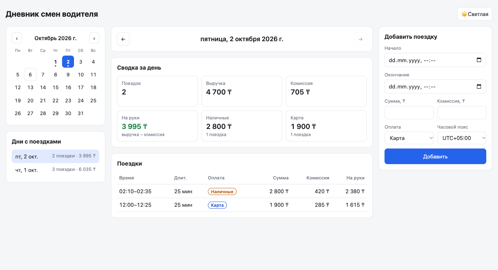
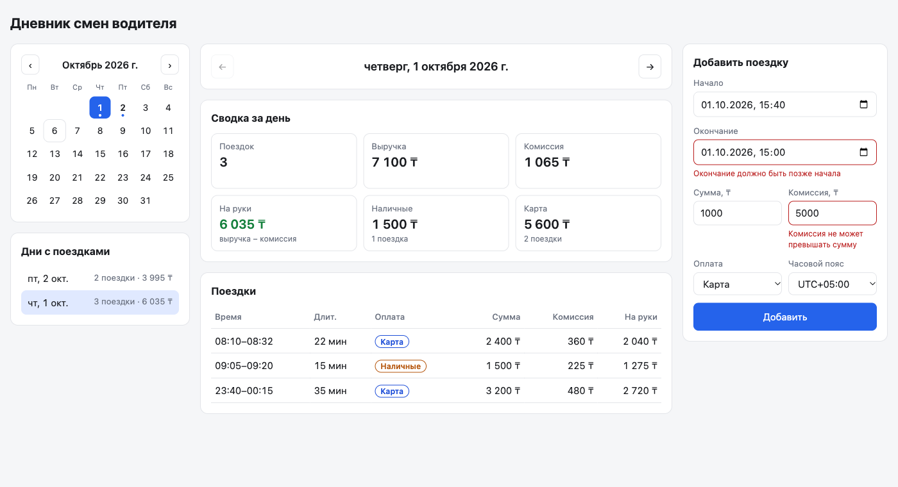
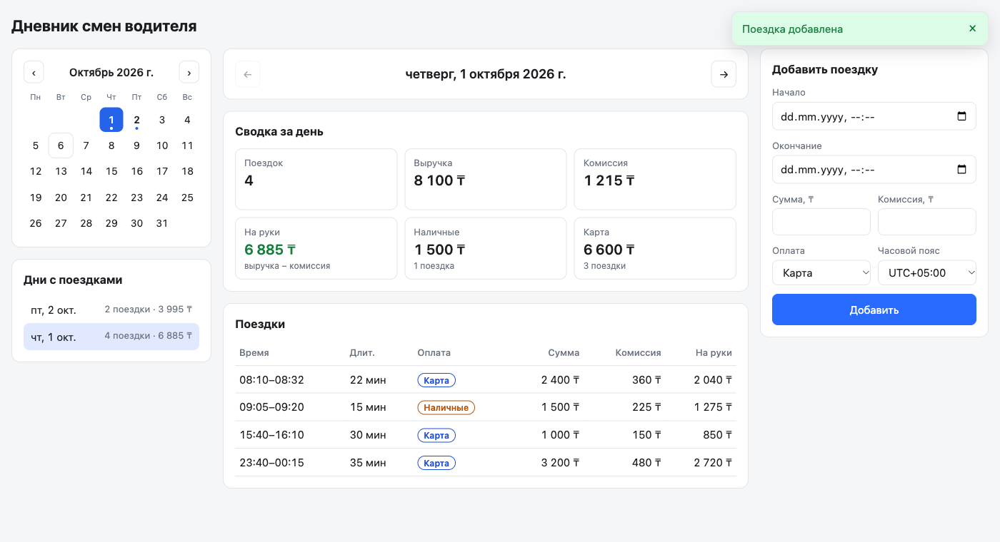
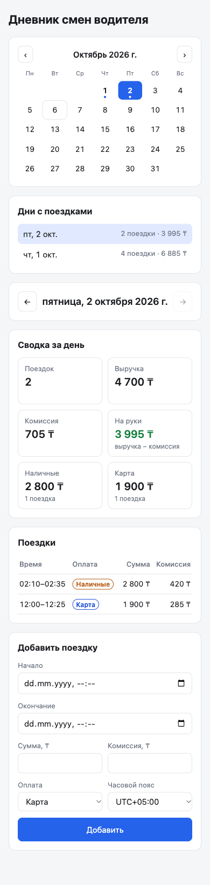

# Дневник смен водителя

Небольшое веб-приложение: водитель видит сводку за день (поездки, выручка, комиссия, «на руки», наличные/карта), список поездок, переключает дни и добавляет новые поездки.

- **Сервер:** Python 3.11+, FastAPI, Pydantic v2
- **Хранилище:** JSON-файл `data/trips.json`
- **Клиент:** одна HTML-страница на чистом JS, раздаётся тем же сервером (сборка не нужна)
- **Тесты:** pytest



## Запуск

```bash
python3 -m venv .venv
.venv/bin/pip install -r requirements.txt
.venv/bin/uvicorn app.main:app --port 8080
```

Открыть http://127.0.0.1:8080

Файл данных можно подменить переменной окружения: `TRIPS_FILE=/path/to/trips.json`.

### Тесты

```bash
.venv/bin/pytest -v
```

25 тестов: расчёт сводки, отнесение поездки к дню, защита от дублей, валидация.

## Что сделано

### API

| Метод | Путь | Описание |
|---|---|---|
| GET | `/api/days` | Дни, в которые есть поездки: `[{date, count, net}]` |
| GET | `/api/trips?date=YYYY-MM-DD` | Поездки за день, по времени начала |
| GET | `/api/summary?date=YYYY-MM-DD` | Сводка за день |
| POST | `/api/trips` | Добавить поездку |

Интерактивная документация: http://127.0.0.1:8080/docs

```bash
curl "http://127.0.0.1:8080/api/summary?date=2026-10-01"
```
```json
{"date": "2026-10-01", "count": 3, "revenue": 7100, "commission": 1065, "net": 6035,
 "cash": {"count": 1, "amount": 1500}, "card": {"count": 2, "amount": 5600}}
```

```bash
curl -X POST http://127.0.0.1:8080/api/trips -H "Content-Type: application/json" -d '{
  "id": "t6", "start": "2026-10-02T14:00:00+05:00", "end": "2026-10-02T14:30:00+05:00",
  "amount": 2000, "payment": "cash", "commission": 300}'
```

Ответы `POST /api/trips`:

| Код | Когда |
|---|---|
| 201 | Поездка создана |
| 200 | Такая поездка уже есть (повторная отправка) — возвращается существующая, дубль не создаётся |
| 409 | Поездка с этим `id` уже есть, но с другими данными |
| 422 | Ошибка валидации; в `detail` — **все** ошибки сразу, у каждой своё поле (`loc`) и код (`type`) |

### Клиент

- Слева — календарь (дни с поездками отмечены точкой, клик открывает день) и список дней с числом поездок и суммой «на руки»; кнопки ← → переходят к соседнему дню с поездками.
- В центре — сводка за день и таблица поездок.
- Справа — форма добавления; ошибки валидации показываются под соответствующими полями.
- Уведомления («Поездка добавлена», «Такая поездка уже есть», ошибки сервера) — всплывающие.
- Светлая/тёмная тема: по умолчанию как в системе, переключатель в шапке.
- Адаптивная вёрстка: на телефоне колонки идут друг под другом.

| Ошибки под полями | Уведомление | Телефон |
|---|---|---|
|  |  |  |

## Принятые решения

1. **К какому дню относится поездка — по локальному времени начала**, с тем смещением, которое записано в самой поездке (`+05:00`), а не по UTC. Иначе поездка в 02:10 по местному времени (21:10 UTC предыдущего дня) уехала бы во вчерашний день. Поездка через полночь (23:40–00:15) относится к дню начала. Обе ситуации есть в примере данных и в тестах.
2. **«На руки» = выручка − комиссия.** Разбивка наличные/карта — по сумме поездок.
3. **Деньги — целые числа** (тенге), без float.
4. **Валидация:** `amount > 0`; `end > start`; `0 ≤ commission ≤ amount`; `payment` ∈ {`cash`, `card`}; у времени обязателен часовой пояс.
5. **Защита от дублей (идемпотентность):**
   - тот же `id` и те же данные → 200, существующая запись;
   - тот же `id`, другие данные → 409 (молча перезаписывать или игнорировать опасно);
   - запрос без `id` → сервер вычисляет `id` как хеш содержимого (`start`, `end` в UTC, `amount`, `payment`, `commission`), поэтому повторная отправка формы тоже не создаст дубль;
   - время сравнивается как момент, а не как строка: `10:00+05:00` и `05:00Z` — одна и та же поездка.
6. **Хранилище** — JSON-файл; запись атомарная (временный файл + `os.replace`) и под блокировкой, чтобы проверка на дубль и запись не разъезжались при параллельных запросах.

### Ограничения

- Один водитель, без авторизации.
- Блокировка — внутри одного процесса; для нескольких воркеров или серверов нужна БД (например, SQLite с уникальным ключом по `id`).
- Две действительно разные поездки без `id` с полностью совпадающими временем и суммами будут считаться одной — на практике это маловероятно, а клиент с собственными `id` такого ограничения не имеет.

## Структура

```
app/
  main.py      # FastAPI: роуты, раздача static
  models.py    # Pydantic-модели и валидация
  summary.py   # расчёт сводки и списка дней (чистые функции)
  storage.py   # JSON-хранилище, идемпотентное добавление
static/index.html
data/trips.json
tests/
  test_summary.py
  test_api.py
```

## Как использовался ИИ

Проект сделан вместе с Claude Code: сначала согласовали план (стек, API, правила дня и дублей), затем код писался по шагам с подтверждением каждого шага, после каждого шага — тесты и проверка в браузере (Playwright).

**Где ИИ ошибся и что исправлено:**

- **Валидация показывала только одну ошибку.** Первая версия проверяла `end > start` и `commission ≤ amount` в общем `model_validator` Pydantic. Такой валидатор не запускается, если хотя бы одно поле уже невалидно, — при сумме 0 и окончании раньше начала пользователь видел только ошибку суммы. Нашлось при ручной проверке формы; перенесено в валидаторы полей, добавлен тест, что все ошибки приходят одним ответом.
- **Тесты не запускались** — pytest не находил пакет `app`; добавлен `pytest.ini` с `pythonpath`.
- **Мелочи интерфейса:** «1 поездок» вместо «1 поездка» (добавлено склонение), «Октябрь 2026 Г.» из-за CSS `text-transform: capitalize`, обрезанная колонка таблицы на телефоне.

**Что поправлено по моему ревью:**

- статичное сообщение под формой заменено на всплывающие уведомления;
- ошибки валидации перенесены под поля;
- поля даты были слишком узкими — дата/время окончания не помещались; форма вынесена в боковую колонку, поля на всю ширину;
- добавлена боковая панель с календарём и списком дней для быстрого перехода, а не только листание стрелками;
- добавлен переключатель темы;
- комментарии в коде переведены на английский.
