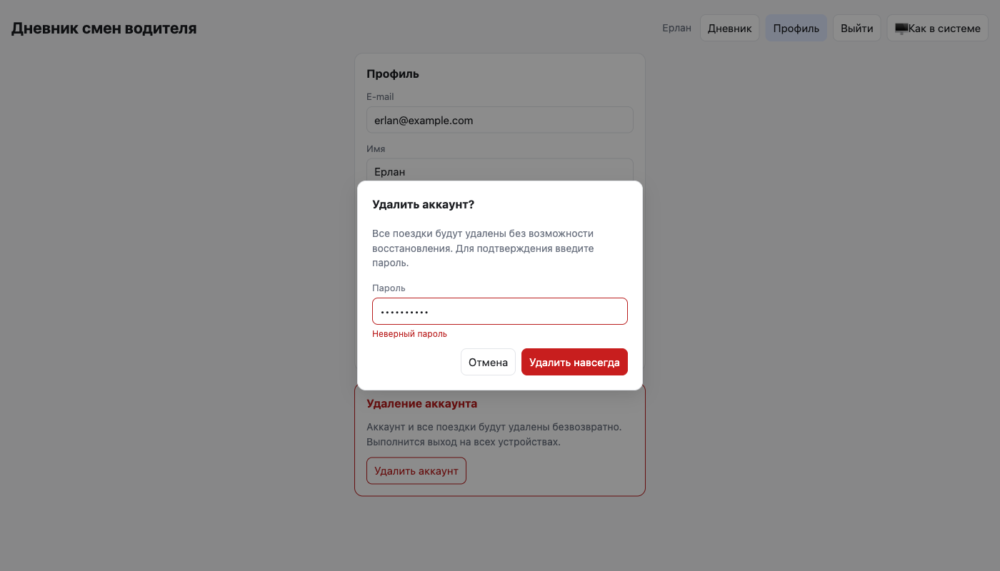

# Дневник смен водителя

Веб-приложение для водителя: личный кабинет, сводка за день (поездки, выручка, комиссия, «на руки», наличные/карта), список поездок, переключение дней, добавление поездок.

- **Сервер:** Python 3.12, FastAPI, Pydantic v2, psycopg 3
- **База данных:** PostgreSQL 16
- **Клиент:** одна HTML-страница на чистом JS, раздаётся тем же сервером (сборка не нужна)
- **Запуск:** Docker Compose
- **Тесты:** pytest на настоящей PostgreSQL (64 теста)


## Запуск в Docker

```bash
docker compose up --build
```

Открыть http://127.0.0.1:8080 и войти демо-водителем: **demo@example.com / demo12345** — или зарегистрировать свой аккаунт.

Демо-водитель с поездками из `data/trips.json` создаётся один раз, в пустой базе (`SEED_DEMO=1`). Данные хранятся в томе `pgdata` и переживают перезапуск; начать с чистой базы: `docker compose down -v`.

Переменные (пароль базы, `SEED_DEMO`, `COOKIE_SECURE` для HTTPS) — в [`.env.example`](.env.example); скопируйте его в `.env`, чтобы поменять значения.

## Локальная разработка и тесты

```bash
docker compose up -d db                      # только PostgreSQL, порт 5433
python3 -m venv .venv
.venv/bin/pip install -r requirements-dev.txt

SEED_DEMO=1 .venv/bin/uvicorn app.main:app --port 8080 --reload
.venv/bin/pytest -v
```

Тесты используют отдельную базу `shifts_test` (создаётся контейнером при первом запуске) и очищают её перед каждым тестом. Если PostgreSQL недоступна, тесты, которым нужна база, пропускаются с подсказкой, как её поднять.

## Что сделано

### Личный кабинет
- Регистрация по e-mail и паролю, вход, выход.
- Каждый водитель видит и добавляет только свои поездки.
- Профиль: имя, автомобиль, часовой пояс и процент комиссии по умолчанию — подставляются в форму новой поездки (комиссия считается от суммы, пока её не поправили вручную).
- Удаление аккаунта с подтверждением паролем: удаляются водитель, все его поездки и все сессии.

| Вход | Профиль | Удаление аккаунта |
|---|---|---|
|  |  |  |

### Дневник
- Слева — календарь (дни с поездками отмечены точкой, клик открывает день) и список дней с числом поездок и суммой «на руки»; кнопки ← → переходят к соседнему дню с поездками.
- В центре — сводка за день и таблица поездок.
- Справа — форма добавления; ошибки валидации показываются под полями.
- Всплывающие уведомления, светлая/тёмная тема (по умолчанию как в системе), адаптивная вёрстка.

| Ошибки под полями | Тёмная тема | Телефон |
|---|---|---|
|  |  |  |

### API

Интерактивная документация: http://127.0.0.1:8080/docs

| Метод | Путь | Описание |
|---|---|---|
| POST | `/api/auth/register` | Регистрация `{email, password, name}`, сразу открывает сессию |
| POST | `/api/auth/login` | Вход `{email, password}` |
| POST | `/api/auth/logout` | Выход |
| GET | `/api/me` | Профиль |
| PATCH | `/api/me` | Изменить профиль (только присланные поля) |
| DELETE | `/api/me` | Удалить аккаунт `{password}` |
| GET | `/api/days` | Дни с поездками: `[{date, count, net}]` |
| GET | `/api/trips?date=YYYY-MM-DD` | Поездки за день |
| GET | `/api/summary?date=YYYY-MM-DD` | Сводка за день |
| POST | `/api/trips` | Добавить поездку |
| GET | `/api/health` | Проверка сервиса и базы (для healthcheck) |

Все методы, кроме регистрации, входа и `health`, требуют сессию (cookie) и без неё отвечают **401**.

```bash
curl -c jar -H 'Content-Type: application/json' \
  -d '{"email":"demo@example.com","password":"demo12345"}' http://127.0.0.1:8080/api/auth/login

curl -b jar "http://127.0.0.1:8080/api/summary?date=2026-10-01"
# {"date":"2026-10-01","count":3,"revenue":7100,"commission":1065,"net":6035,
#  "cash":{"count":1,"amount":1500},"card":{"count":2,"amount":5600}}

curl -b jar -H 'Content-Type: application/json' http://127.0.0.1:8080/api/trips -d '{
  "id":"t6","start":"2026-10-02T14:00:00+05:00","end":"2026-10-02T14:30:00+05:00",
  "amount":2000,"payment":"cash","commission":300}'
```

Ответы `POST /api/trips`:

| Код | Когда |
|---|---|
| 201 | Поездка создана |
| 200 | Такая поездка уже есть (повторная отправка) — возвращается существующая, дубль не создаётся |
| 409 | У водителя уже есть поездка с этим `id`, но с другими данными |
| 422 | Ошибка валидации; в `detail` — **все** ошибки сразу, у каждой своё поле (`loc`) и код (`type`) |

## Принятые решения

1. **К какому дню относится поездка — по локальному времени начала**, с тем смещением, которое записано в самой поездке (`+05:00`), а не по UTC. Иначе поездка в 02:10 по местному времени (21:10 UTC предыдущего дня) уехала бы во вчерашний день. Поездка через полночь (23:40–00:15) относится к дню начала.
2. **Смещение хранится в PostgreSQL отдельно.** `timestamptz` хранит момент времени и теряет исходное смещение: из базы вернулось бы `21:10Z`, и правило из пункта 1 сломалось бы. Поэтому у поездки есть колонки `start_offset_min`, `end_offset_min` и вычисленный `local_day` (по нему индекс и выборка дня), а API отдаёт время ровно в том виде, в каком его прислали.
3. **«На руки» = выручка − комиссия.** Деньги — целые числа (тенге), без float.
4. **Валидация:** `amount > 0`; `end > start`; `0 ≤ commission ≤ amount`; `payment` ∈ {`cash`, `card`}; у времени обязателен часовой пояс. Те же ограничения продублированы `CHECK`-ами в схеме.
5. **Защита от дублей — на уровне базы:** первичный ключ `(driver_id, id)` и `INSERT … ON CONFLICT DO NOTHING`. Если строка не вставилась, существующая сравнивается с присланной:
   - те же данные → 200, существующая запись;
   - другие данные → 409 (молча перезаписывать или игнорировать опасно);
   - запрос без `id` → сервер вычисляет `id` как хеш содержимого, поэтому повторная отправка формы тоже не создаст дубль;
   - время сравнивается как момент: `10:00+05:00` и `05:00Z` — одна и та же поездка;
   - одинаковый `id` у разных водителей — не конфликт.

   Это корректно и при одновременных запросах, и при нескольких процессах: тест отправляет одну поездку из 8 потоков и проверяет, что запись ровно одна.
6. **Аутентификация:**
   - пароли — `scrypt` с солью (стандартная библиотека Python);
   - сессия — случайный токен в cookie `HttpOnly; SameSite=Lax` на 30 дней, в базе хранится только SHA-256 токена;
   - неверный пароль и неизвестный e-mail дают одинаковый ответ за одинаковое время (для неизвестного e-mail проверяется фиктивный хеш);
   - 5 неудачных попыток входа за 15 минут → 429 с `Retry-After`; тот же лимит на подтверждение пароля при удалении аккаунта;
   - CSRF: изменяющие запросы принимают только `application/json`, которое не может отправить обычная HTML-форма с чужого сайта.
7. **Удаление аккаунта** требует пароль: одной украденной cookie недостаточно, чтобы стереть данные. Поездки и сессии удаляются каскадно (`ON DELETE CASCADE`).

### Ограничения

- Лимит попыток входа хранится в памяти процесса, поэтому приложение запускается одним воркером; для нескольких экземпляров лимит нужно вынести в общее хранилище (таблица или Redis).
- Нет восстановления пароля и подтверждения e-mail — для этого нужна отправка писем.
- Схема создаётся при старте (`CREATE TABLE IF NOT EXISTS`); при развитии проекта стоит перейти на миграции (Alembic).
- Две действительно разные поездки без `id` с полностью совпадающими временем и суммами считаются одной; клиент с собственными `id` такого ограничения не имеет.

## Структура

```
app/
  main.py        # FastAPI: роуты, зависимости (сессия, CSRF), запуск
  models.py      # Pydantic-модели и валидация
  schema.sql     # схема PostgreSQL
  db.py          # пул соединений, применение схемы
  storage.py     # поездки: выборки и идемпотентное добавление
  accounts.py    # водители, сессии, профиль
  security.py    # хеширование паролей, лимит попыток входа
  summary.py     # расчёт сводки за день (чистая функция)
  seed.py        # демо-водитель
static/index.html
data/trips.json  # демо-данные
db/init/         # создание тестовой базы в контейнере
tests/           # test_summary, test_storage, test_api, test_auth, test_isolation
Dockerfile, docker-compose.yml, .env.example
```

## Как использовался ИИ

Проект сделан вместе с Claude Code. Сначала согласовали план (стек, API, правила дня и дублей), затем код писался по шагам с подтверждением каждого шага; после каждого шага — тесты и проверка в браузере (Playwright). Личный кабинет и переход на PostgreSQL + Docker — отдельный план и шесть шагов, по коммиту на шаг.

**Где ИИ ошибся и что исправлено:**

- **Валидация показывала только одну ошибку.** Первая версия проверяла `end > start` и `commission ≤ amount` в общем `model_validator` Pydantic. Такой валидатор не запускается, если хотя бы одно поле уже невалидно, — при сумме 0 и окончании раньше начала пользователь видел только ошибку суммы. Нашлось при ручной проверке формы; перенесено в валидаторы полей, добавлен тест, что все ошибки приходят одним ответом.
- **Ловушка `timestamptz`.** При переходе на PostgreSQL наивное хранение времени в `timestamptz` потеряло бы смещение `+05:00` и вернуло бы ошибку с отнесением ночных поездок к предыдущему дню. Смещение и день вынесены в отдельные колонки, добавлен тест на сохранение и чтение.
- **Тесты не запускались** — pytest не находил пакет `app`; добавлен `pytest.ini` с `pythonpath`.
- **`form.name` в JS** — у HTML-формы есть собственное свойство `name`, обращение к полю «Имя» через него неоднозначно; заменено на `form.elements.name`.
- **Уведомления перекрывали кнопки навигации** в шапке после её появления — перенесены в правый нижний угол.
- **Мелочи интерфейса:** «1 поездок» вместо «1 поездка» (добавлено склонение), «Октябрь 2026 Г.» из-за CSS `text-transform: capitalize`, обрезанная колонка таблицы на телефоне.

**Что поправлено по моему ревью:**

- статичное сообщение под формой заменено на всплывающие уведомления;
- ошибки валидации перенесены под поля;
- поля даты были слишком узкими — дата/время окончания не помещались; форма вынесена в боковую колонку, поля на всю ширину;
- добавлена боковая панель с календарём и списком дней для быстрого перехода, а не только листание стрелками;
- добавлен переключатель темы;
- добавлены личный кабинет водителя и удаление аккаунта;
- выбраны PostgreSQL вместо JSON-файла и запуск в Docker;
- комментарии в коде переведены на английский.
